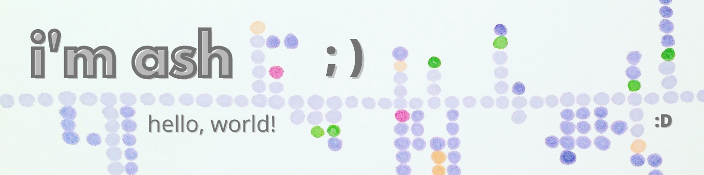

I'm a Fullstack Developer working in the Javascript Multiverse. I currently perfer the backend, nerding out on db schemas. I'm passionate about learning, creating things that didn't exist before, and being more stubborn than my bugs. When not coding, you can find me reading a sci-fi/fantasy book, painting a mural, or taking another dance class. Who else is learing Zouk?

## Technologies I enjoy
| Backend | Frontend | Data | API | 
| :--- | :--- | :--- | :--- |
|   `NodeJS` |   `React` |   `MySQL, PostgreSQL` |   `GraphQL` |
|   `Express` |   `Typescript` |   `MongoDB, Mongoose` |   `REST` |
|   `Koa` |   `Angular` |   `DynamoDB` |   `OpenAPI` |

## Stats

## The State of Things
- 🔭 I’m currently working on a secret project
- 🌱 I’m currently practicing Javascript: The Hard Parts
- 👯 I’m looking to collaborate on open source projects!
- 🤔 I’m looking for help with ...finding open source opportunities!
- 💬 Ask me about partner dancing
- 📫 How to reach me: ash.b.mudra@gmail.com
- 😄 Pronouns: she/her
- ⚡ Fun fact: Was just diagnosed with adhd. It's a whole new world, folks.
