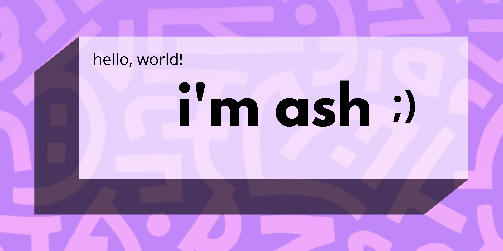

  

Nice to meet you! I'm Ash, a Fullstack Developer with focused experience in JavaScript and React Multiverse. I currently prefer the backend and nerding out on db schemas. I'm passionate about learning, creating things that didn't exist before, and being more stubborn than my bugs. When not coding, you can find me reading a sci-fi/fantasy book, painting a mural, or taking another dance class. Who else is learing Zouk? 

  
## Technologies I Enjoy

     

| Data | Backend | Frontend | API |
| :--- | :--- | :--- | :--- |
|   `MySQL` |   `NodeJS` |   `React` |   `GraphQL` 
|   `PostgreSQ` |   `Express` |   `React Native` |   `REST` |
|   `MongoDB` |   `Koa` |   `Typescript` |   `OpenAPI` |

  
## Let's Be Friends
- 👂 Check out my calming, no-lyrics playlist I made for coders: [Brain Juice](https://open.spotify.com/playlist/4E9aUH5H21WFJy5deVYZT4?si=edf616c619774ca7)
- 🔭 I’m currently working on a secret project with an incredible team! Unveiling 7/2/22
- 🌱 I’m currently learning Python
- 👯 I’m looking to collaborate on open source projects!
- 🤔 I’m looking for help with ...finding open source opportunities!
- 💬 Ask me about partner dancing, acro yoga, or contact improv
- 📫 How to reach me. I like making new friends and collaborating: ash.b.mudra@gmail.com
- 😄 Pronouns: she/her
- ⚡ Fun fact: I just found out I have adhd. It's a whole new world, folks!

  
##

